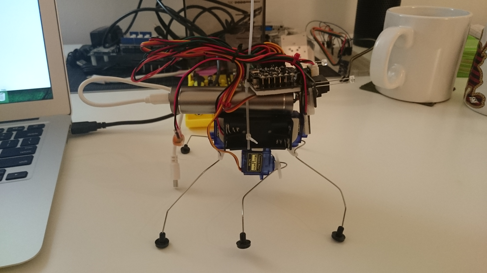
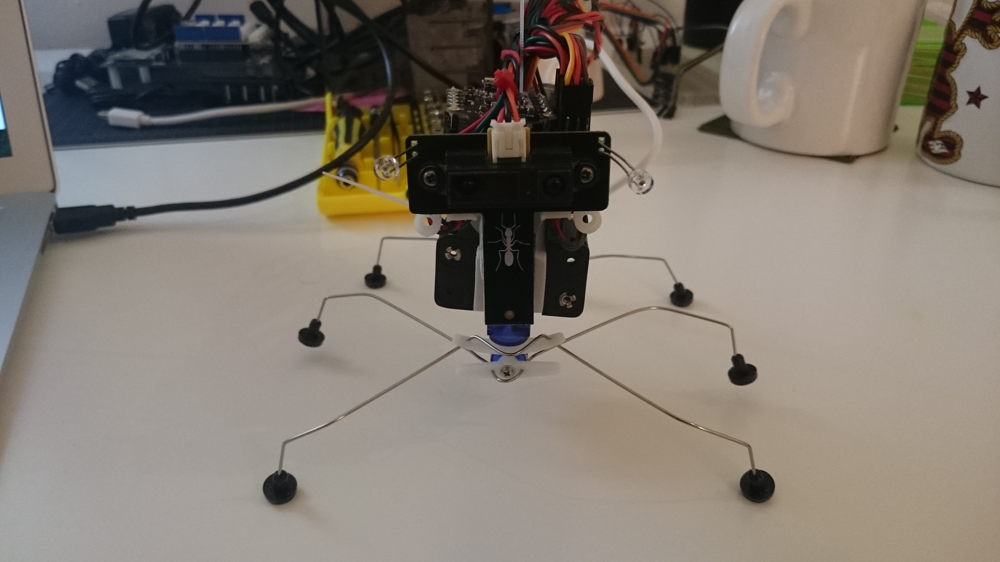

## Insectbot Hexa from DFRobot

This is my [Insectbot Hexa](http://www.dfrobot.com/index.php?route=product/product&path=37_69&product_id=1217#.Vc6rX1NViko) from [DFRobot](http://www.dfrobot.com)

## Features

* Walks in 4 directions (Forward, Backward, Left, Right)
* Controlled over BLE from command line tool

## To Do

* Create mobile app to control bot over BLE
* Add autonomous mode
* Report sensor readings to app over BLE
* 3D print new mechanical design